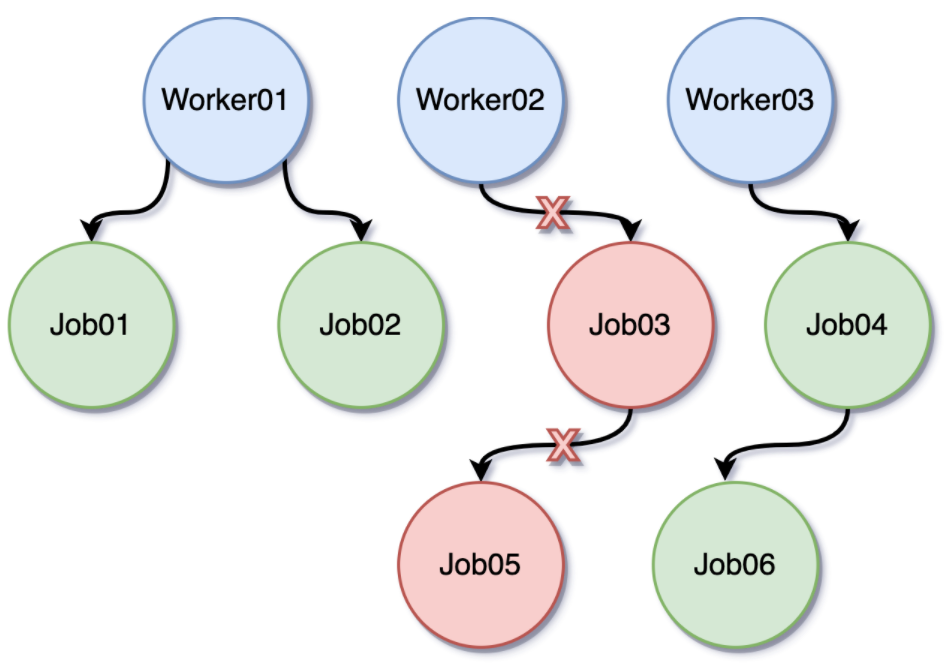

# Context

Golang 控制併發主要有兩種方式：

1. WaitGroup
2. Context

## 使用 WaitGroup 的場景

將一件事拆成幾個 job 去執行，要在全部 job 都執行完之後，再繼續執行主程式。

很基本的寫法：

```go
package main

import (
	"fmt"
	"sync"
	"time"
)

func main() {
	var wg sync.WaitGroup

	// 假設有 2 個 job
	wg.Add(2)

	go func() {
		time.Sleep(2 * time.Second)
		fmt.Println("job 1 done")
		wg.Done()
	}()
	go func() {
		time.Sleep(1 * time.Second)
		fmt.Println("job 2 done")
		wg.Done()
	}()

	wg.Wait()
	fmt.Println("all jobs done")
}
```

## 終止 goroutine 的寫法

假設有一個背景程式監控，需要長時間執行，UI 上面有停止的按鈕，點下去後，主動通知並停止正在跑的 job，可以使用 `channel + select`

```go
package main

import (
	"fmt"
	"time"
)

func main() {
	stop := make(chan bool)

	// goroutine 一直在背景跑
	go func() {
		for {
			select {
			case <-stop: // channel 讀到東西就停止 job
				fmt.Println("got the stop channel")
				return
			default:
				fmt.Println("still working")
				time.Sleep(1 * time.Second)
			}
		}
	}()

	time.Sleep(5 * time.Second)
	fmt.Println("stop the goroutine")
	stop <- true // 塞東西進去 channel 來停止 job
	time.Sleep(5 * time.Second)
}
```

上面的例子相對單純，但如果我們的情境如下圖，goroutine 裡面還有 goroutine，要如何控制？或者是一次停止三個 worker？就需要 context 惹。



## Context

- 關閉 context 時，就可以停止底下所有的 worker

將上面的例子改成 context，寫法大同小異，把 channel 改成 context

```go
package main

import (
	"context"
	"fmt"
	"time"
)

func main() {
	ctx, cancel := context.WithCancel(context.Background())

	go func() {
		for {
			select {
			case <-ctx.Done():
				fmt.Println("got the stop channel")
				return
			default:
				fmt.Println("still working")
				time.Sleep(1 * time.Second)
			}
		}
	}()

	time.Sleep(5 * time.Second)
	fmt.Println("stop the goroutine")
	cancel()
	time.Sleep(1 * time.Second)
}
```

用 1 個 context，來停止 3 個 job

```go
package main

import (
	"context"
	"fmt"
	"time"
)

func main() {
	// 建立一個 context
	ctx, cancel := context.WithCancel(context.Background())

	// 該 context 下面有三個 node
	go worker(ctx, "node01")
	go worker(ctx, "node02")
	go worker(ctx, "node03")

	time.Sleep(5 * time.Second)
	fmt.Println("stop the goroutine")
	cancel() // context 取消時，底下全部 node 都會停止
	time.Sleep(5 * time.Second)
}

func worker(ctx context.Context, name string) {
	for {
		select {
		case <-ctx.Done():
			fmt.Println(name, "got the stop channel")
			return
		default:
			fmt.Println(name, "still working")
			time.Sleep(1 * time.Second)
		}
	}
}
```

## 心得

初探 context，了解了最基本的用法，還沒有實務經驗，其實連 select 用法都沒很熟 XD

應該可以試試在 [blog-server](https://github.com/Apriil15/blog-server) 加上 graceful shutdown?!

## Reference

小惡魔大大寫的清楚明瞭 R

[用 10 分鐘了解 Go 語言 context package 使用場景及介紹](https://blog.wu-boy.com/2020/05/understant-golang-context-in-10-minutes/)
